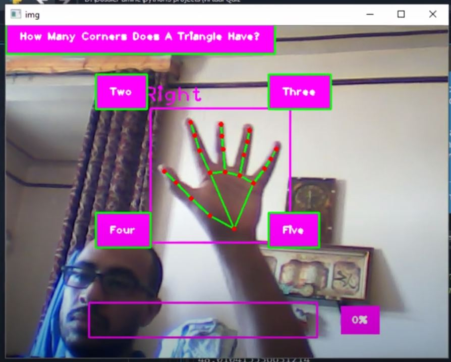

# A virtual Quiz Based On Artificial Intelligence(OpenCv2+Mediapipe And CvZone)
I will share with you a virtual quiz game using artificial intelligence. i will import all the questions using a csv file and then use our hand in the air to answer them. 
the project developed using python language and it works with these libraries : 
- numpy to install it put this command (pip install numpy)
- mediapipe to install it put this command (pip install mediapipe)
- opencv to install it put this command (pip install opencv-python)
- cvzone to install it put this command (pip install cvzone)

demonstration demo video : https://www.youtube.com/watch?v=fFI9kKQso-0https://www.youtube.com/watch?v=fFI9kKQso-0
# Screenshot

# A details Video Explanation
https://www.youtube.com/watch?v=-wXVl1DRRzE
